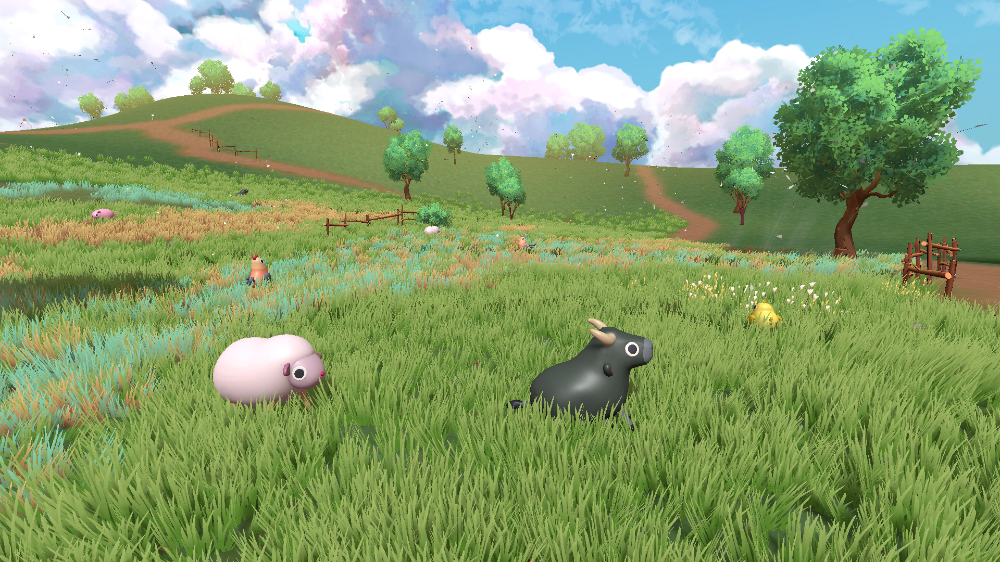
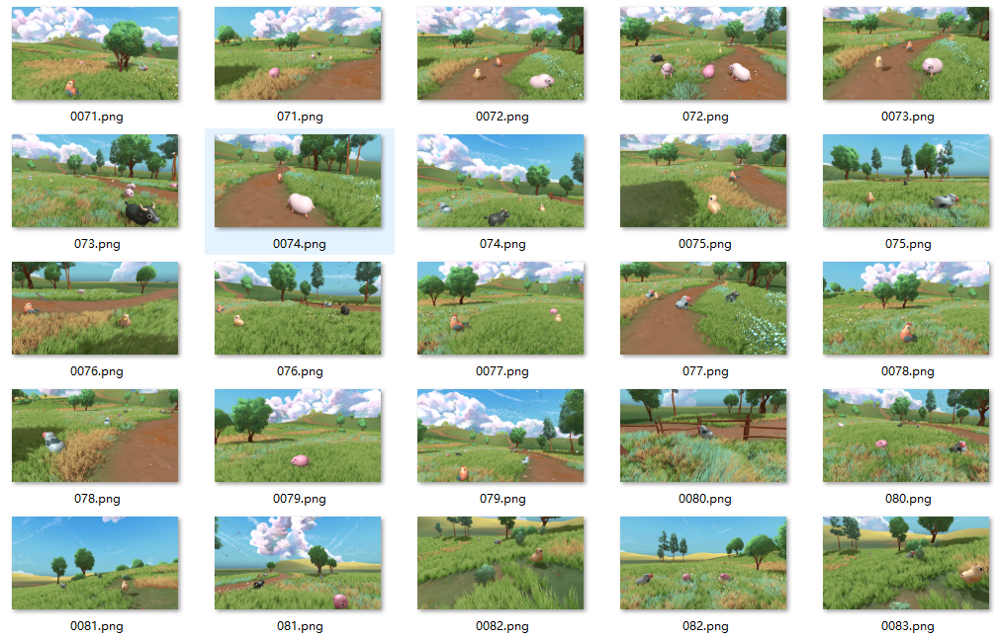
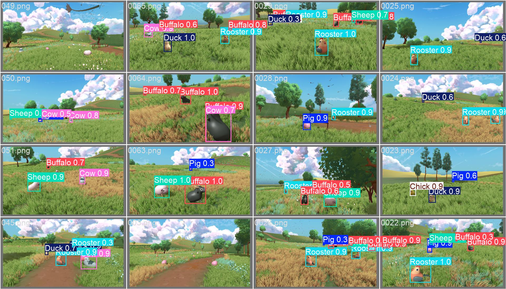

# Integrating YOLO Object Detection into 3D Game Development

## 1. Introduction
This project implements object detection in a 3D game environment using fine-tuned YOLOv11 models.   
It features two main modes: **Photo Mode** and **Real-Time Inference Mode**. This repository only contains the core code, and details about each functionality are provided below.

このプロジェクトは、微調整されたYOLOv11モデルを使用して、3Dゲーム環境で物体検出を実現する。主に「写真モード」と「リアルタイム推論モード」の2つのモードを特徴とする。  
このリポジトリはコアコードのみを含み、各機能の詳細は以下に記載する。

- **Game Demo Download**: [Not yet available]  
- **Demo Video**: [[Link](https://drive.google.com/file/d/1o9uRG3V_Z9lVy1Uda0aQWKHMYT2dVhl4/view?usp=sharing)]  

---

## 2. Environment Configuration
- **Unity**: 2023.1.31f1  
- **Sentis**: 2.1.1  

---

## 3. Gameplay Instructions
1. **Character Control**  
   - Use **WSAD** to move.  
   - Use **Shift** to sprint and **Spacebar** to jump.

2. **Photo Mode**  
   - Press **O** to enter Photo Mode.  
   - In Photo Mode, press **V** to capture a photo and save the screenshot.  
   - After taking the photo, press **C** to analyze the animal elements in the image.

3. **Real-Time Analysis Mode**  
   - Press **P** in Normal Mode to enter Real-Time Analysis Mode, dynamically analyzing objects in the surroundings.

  
  

---

## 4. Game Features
1. **Multi-Level YOLO Optimization**  
   - Different YOLO models are used for Photo Mode and Real-Time Analysis Mode. Photo Mode prioritizes accuracy, while Real-Time Mode optimizes speed.

2. **Custom Dataset Fine-Tuning**  
   - A dataset of 700 images covering 7 animal categories was created and fine-tuned to improve the model's performance.

  
   

3. **Advantages of AI Technology**  
   - AI-powered object detection enhances interactivity and immersion, offering players a dynamic and diverse gaming experience.

---

## 5. Future Improvements
1. Implement image segmentation to improve detection accuracy and visualization.  
2. Design new gameplay mechanisms based on coordinates obtained from model inference.  
3. Introduce multi-object tracking to allow interaction with multiple dynamic targets.

---

## 6. Functionality Overview
1. **YOLO Implementation**  
   - Refer to the [`YOLO_Scripts`](0_Assets/Scripts/1_YOLO_Scripts)  and [`Model`](0_Assets/Model)  folder's [`YOLO_README.md`](0_Assets/Scripts/1_YOLO_Scripts/README.md) and [`Model_README.md`](0_Assets/Model/README.md) for details.

2. **Photo Mode Switching**  
   - Refer to the [`Photo_Scripts`](0_Assets/Scripts/2_Photo_Scripts)  folder's [`README.md`](0_Assets/Scripts/2_Photo_Scripts/README.md) for details.

3. **NPC Module**  
   - Refer to the [`Npc_Scripts`](0_Assets/Scripts/3_Npc_Scripts) folder's [`README.md`](0_Assets/Scripts/3_Npc_Scripts/README.md) for details.

---

For any issues or questions, feel free to reach out or open an issue.
